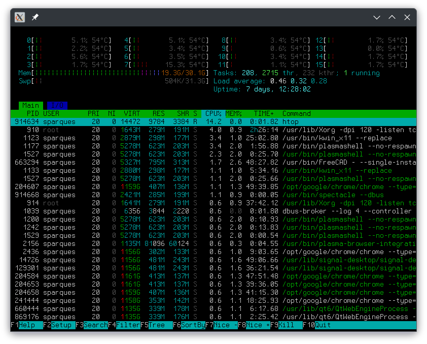

# FANSITERM

Fake (virtual) ANSI TERMinal. 

Fansiterm is a golang package for implementing a partially compatible ANSI terminal, rendered to an image.Image (really, a golang.org/x/image/draw.Image). This is suitable for the graphical back-end of a virtual terminal emulator.

The intent is for implementing a terminal on micro controllers connected to graphical displays. This provides an easy way to make a TUI for the micro controller and take advantage of packages like github.com/charmbracelet/bubbletea or for making a simple dumb terminal-type device.

# Overview

The (*fansiterm.Device) object implements io.Writer. (*fansiterm.Device).Render implements image.Draw. To push data (text) to the terminal, you simply call Write() against the Device object.

The text isn't buffered anywhere, if you need the text or want to implement more advanced features like scrolling, that's up to whatever is writing to (*fansiterm).Device. Incomplete escape sequences will be buffered and it's possible to "hang" the terminal by sending an incomplete sequence and then overloading the system memory. This is inline with how actual physical dumb terminals of yore worked.

If you want to push your own graphics or other operations, you can draw directly to the (*fansiterm.Device).Render object as well, as it implements draw.Image.

If Device is initialized with a nil image buffer, it allocates its own buffer. Otherwise, you can pass a draw.Image object (like what the driver for an OLED or TFT screen provides you) to it and any Write()s to the (*fansiterm.Device) will be immediately rendered to the backing screen. Whether the screen buffers image data and needs to be manually blitted is screen driver dependent.

For use with microcontrollers, you'll want to pass it the pseudo-buffer provided by the screen driver, as chances are your MCU does not have enough ram for a single frame buffer--in addition to the memory used for all the tiles and the rest of the program.

# Features

 - Cursor styles: Block, Beam, Underscore
 - Bell is supported: a callback is provided for when the terminal receives a \a (bell character). So you could trigger a beep via a speaker and PWM or blink an LED or blink the backlight, etc.
 - Standard cursor manipulation supported.
 - Regular, Bold, and "italic" Font (italics are reasonably faked by rotating individual tiles)
 - Underline, Double Underline, Strike-through
 - Several "TileSets" come built-in: inconsolata, Fira Code Nerd Mono, x3270, julia mono, and fansi
 - Tool to generate additional tilesets from TTF fonts is included: look in tiles/ and tiles/gentileset/
 - Custom Tile loading for alternate character set (shift-out character set, commonly used for line-drawing/pseudo graphics)
 - Tiles are rendered using an 8-bit Alpha mask, allowing for clean blending and anti-aliased rendering of glyphs.
 - 4-bit (with extended codes for bright / high intensity) color; 256-Color; True Color (24 bit).
 	

# Non-Features

The main purpose of this package is for use on rather low-power microcontrollers, so some standard features for terminal emulators are not implemented.

  - Blinking text and blink cursors
    - this would require a some kind of timer-callback. As it is, fansiterm is only using CPU when bytes are being written to it.
  - Resizable Text
    - Right now, the pre-rendered inconsolata.Regular8x16 and inconsolata.Bold8x16 are used.
    - It's possible to use basicfont.Regular7x13, but you have to give up bold support.
  - ~Hardware acceleration~. Fansiterm remains agnostic of what it's rendering to and thus can't take advantage of any double-buffers or hardware-cursors _on its own_. Backwards compatible PRs to improve hardware support / hardware acceleration are very much welcome.
    - Okay, I lied a little bit. By using the interfaces from github.com/sparques/gfx, like Filler, Scroller, and RegionScroller, we can get "hardware acceleration." It's not really hardware acceleration, but when the underlying device can use more efficient algorithms (for example, sending a specific "Fill" command to the display, or even just manipulating video memory directly) you can get much improved performance. Using the pure-Go software implementation of Scroll and Fill, it took an arbitrary amount of lines over two minutes to render. With the Scroller and Fill interfaces supported, that same amount of lines takes slightly more than 2 seconds. (And a "real" Terminal emulator takes about 0.03 seconds. Fansi don't mean fast.)

# TODO

 - ~General Clean Up (Device struct is a bit of a mess)~ Always more to be done, but I'm relatively happy with things now.
 - Package documentation
 	- Reviewing the package documentation now shows me I have far too much exported. A major to do is only have things exported if they actually need to be exported.
 - Test on real hardware
 - ~1-bit color/rendering support for very-very-constrained systems~
 - ~More configurable font / better font configuration~ Now using a purpose-built Tile system. 
 	- Better, user-oriented font config system: The means are in place, now just have to make it easy to use.
 - ~Optimize drawing/rendering routines~ This has been greatly improved.
 	- ~Add in hardware accel / filling rectangle support (some hardware can fill rectangles more efficiently than the equivalent single-pixel-pushing)~
 - Standardize / settle upon an API
 	- Limit your interactions to the io.Write() interface.
 - Modify gentileset utility to only dump specific ranges--currently any of the "Nerd" fonts included (Fira, x3270, and julia) use too much RAM to actually load onto an RP2040.

# Future

I want to keep a very stripped down, bare-bones version of fansiterm that will work on very resource constrained microcontrollers. However, I'm very open to having a more featureful v2 that is suitable for using as a back-end for something as full blown as desktop terminal emulator.

# Screenshot

The screenshot demonstrates:
  - FANSITERM is colored using inverted VGA color ( SGR CSI34;7m ) and is also bold (SGR CSI1m).
  - The trademark character (™) is present in inconsolata.Regular8x16 and rendered correctly here.
  - On either end of FANSITERM are custom tiles, defined using 8x16 pixel PNGs, in the fansi TileSet (fansiterm/tiles/fansi) and set to represent the characters '(' and ')' in the alternate character set (activated with the SHIFT-OUT byte, 0x0E, and deactivated with SHIFT-IN byte, 0x0F).
  - Custom rounded-end-cap tiles are used to surround 433 MHz and KHz, also via alternate character set (and mapped to '{' and '}').
  - The distance between 'Freq:' and '443 MHz' and 'Bandwidth:' and '005 KHz' are managed via tab characters.
  - The gradient bar is implemented using 24-bit True Color and an on-the-fly generated gradient tile.
  - Finally, the cursor is a block style cursor. All cursor shapes are implemented by inverting the colors they land over top.
  - This is a 240x135 pixel. While 240 is evenly divisible by 8, 135 is not divisible by 16. The terminal is automatically centered. (It is a TODO item to add customizable offset).

# htop Screenshot

Yes. Htop works.

# See Also

I found out about this when nearly done with this project:

https://github.com/tinygo-org/tinyterm

Same basic idea--tinyterm is a (tiny)go implementation of a terminal. Tinyterm is meant to be a minimal implementation to aid in troubleshooting projects. Fansiterm is meant to be the main interface / visual subsystem. 

Tinyterm is specifically for tinygo, but fansiterm will work anywhere regular go will.