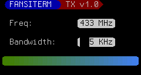

# FANSITERM

Fake (virtual) ANSI TERMinal. 

Fansiterm is a golang package for implementing a partially compatible ANSI terminal, rendered to an image.Image (really, a golang.org/x/image/draw.Image). This is suitable for the graphical backend of a virtual terminal emulator.

The intent is for implementing a terminal on micro controllers connected to graphical displays. This provides an easy way to make a TUI for the micro controller and take advantage of packages like github.com/charmbracelet/bubbletea or for making a simple dumb terminal-type device.

# Overview

The (*fansiterm).Device object implements image.Image, draw.Image, and io.Writer. To push data (text) to the terminal, you simply call Write() against the Device object.

The text isn't buffered anywhere, if you need the text or want to implement more advanced features like scrolling, that's up to whatever is writing to (*fansiterm).Device. Since this is meant to.

If you want to push your own graphics or other operations, you can draw directly to the Device object as well, as it implements draw.Image.

If Device is initialized with a nil image buffer, it allocates its own buffer. Otherwise, you can pass a draw.Image object (like what the driver for an OLED or TFT screen provides you) to it and any Write()s to the (*fansiterm).Device will be immediately rendered to the backing screen. Whether the screen buffers image data and needs to be manually blitted is screen driver dependant. So 

# Features

 - Cursor styles: Block, Beam, Underscore
 - Bell is supported: a callback is provided for when the terminal receives a \a (bell character). So you could trigger a beep via a speaker and PWM or blink an LED or blink the backlight, etc.
 - Standard cursor manipulation supported.
 - Regular and Bold Font
 - Underline, Double Underline, Strikethrough
 - Custom Tile loading for alternate character set (shift-out character set, commonly used for line-drawing/pseudo graphics)
 - Font is rendered using an 8-bit Alpha mask, allowing for clean blending and anti-aliased rendering of glyphs.
 	

# Non-Features

The main purpose of this package is for use on rather low-power microcontrollers, so some standard features for terminal emulators are not implemented.

  - Blinking text and blink cursors
    - this would require a some kind of timer-callback. As it is, fansiterm is only using CPU when bytes are being written to it.
  - Resizable Text
    - Right now, the pre-rendered inconsolata.Regular8x16 and inconsolata.Bold8x16 are used.
    - It's possible to use basicfont.Regular7x13, but you have to give up bold support.
  - Color Pallet / 256-color
    - The standard 4-bit color palette is supported and 24-bit True Color is supported; 256 seems redundant to me.
  - Hardware acceleration. Fansiterm remains aganostic of what it's rendering to and thus can't take advantage of any double-buffers or hardware-cursors _on its own_. Backwards compatible PRs to improve hardware support / hardware acceleration are very much welcome.

# TODO

 - Package documentation
 - Test on real hardware
 - 1-bit color/rendering support for very-very-constrained systems
 - More configurable font / better font configuration
 	- Permit a very stripped down minimal font to be used or alternatively allow every option: Bold, Italic, Fraktur, etc.
 - Optimize drawing/rendering routines.
 - Standardize / settle upon an API
 	- The main interaction will be via io.Write(), that won't change. But things like direct manipulation of the terminal (e.g. calling (*Device).MoveCursorAbs(x,y)) are still in flux.

# Future

I want to keep a very stripped down, barebones version of fansiterm that will work on very resource constrained microcontrollers. However, I'm very open to having a more featureful v2 that is suitable for using as a backend for something as full blown as desktop terminal emulator.

# Screenshot

The screenshot demonstrates:
  - FANSITERM is colored using inverted VGA color ( SGR CSI34;7m ) and is also bold (SGR CSI1m).
  - The trademark character (™) is present in inconsolata.Regular8x16 and rendered correctly here.
  - On either end of FANSITERM are custom tiles, defined using 8x16 pixel PNGs and set to represent the characters '(' and ')' in the alternate chracter set (actived with the SHIFT-OUT byte, 0x0E, and deactived with SHIFT-IN byte, 0x0F).
  - Custom rounded-endcap tiles are used to surround 433 MHz and KHz, also via alternate chracter set (and mapped to '{' and '}').
  - The distance between 'Freq:' and '443 MHz' and 'Bandwidth:' and '005 KHz' are managed via tab characters.
  - The gradient bar is implemented using 24-bit True Color.
  - Finally, the cursor is a block style cursor. All cursor shapes are implemented by inverting the colors they land over top.